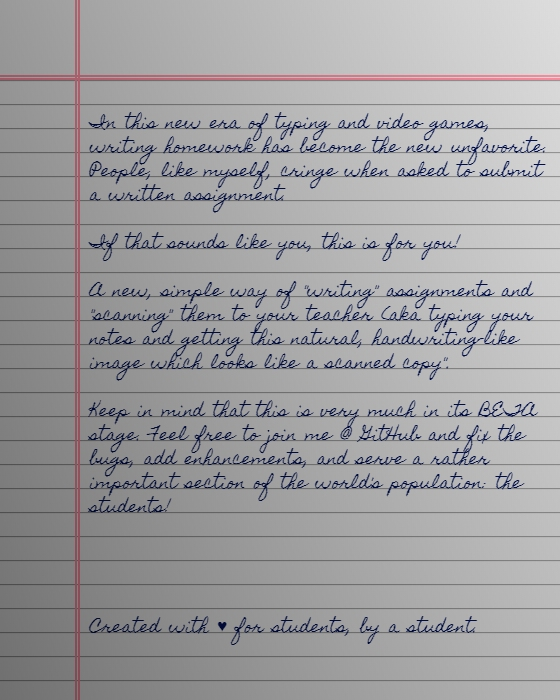

# Text To Writing

In this new era of typing and video games, writing homework has become the new unfavorite. People, like myself, cringe when asked to submit a written assignment.

If that sounds like you, this is for you!

A new, simple way of "writing" assignments and "scanning" them to your teacher (aka typing your notes and getting this natural, handwriting-like image which looks like a scanned copy".

Keep in mind that this is very much in its BETA stage. Feel free to join me @ GitHub and fix the bugs, add enhancements, and serve a rather important section of the world's population: the students!

Created with ♥ for students, by a student.

# Snapshot

